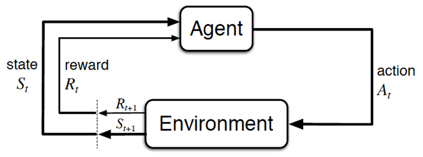

强化学习基本概念
 

## 1、强化学习的模型
### 1.1、Agent、Action、Environment、Reward、State
 
1. Agent，一般译为智能体，就是我们要训练的模型，类似玩超级玛丽的时候操纵马里奥做出相应的动作，而这个马里奥就是Agent
2. action(简记为)，玩超级玛丽的时候你会控制马里奥做三个动作，即向左走、向右走和向上跳，而马里奥做的这三个动作就是action
3. Environment，即环境，它是提供reward的某个对象，它可以是AlphaGo中的人类棋手，也可以是自动驾驶中的人类驾驶员，甚至可以是某些游戏AI里的游戏规则
4. reward(简记为)，这个奖赏可以类比为在明确目标的情况下，接近目标意味着做得好则奖，远离目标意味着做的不好则惩，最终达到收益/奖励最大化，且这个奖励是强化学习的核心
5. State(简介为)，可以理解成环境的状态，简称状态

### 1.2、马尔可夫决策过程（MDP）
当且仅当某时刻的状态只取决于上一时刻的状态时，一个随机过程被称为具有马尔可夫性质，即$$P(S_{t+1}|S_t) = P(S_{t+1}|S_1,\cdots ,S_t)$$当然了，虽说当前状态只看上一个状态，但上一个状态其实包含了更上一个状态的信息，所以不能说当下与历史是无关的
